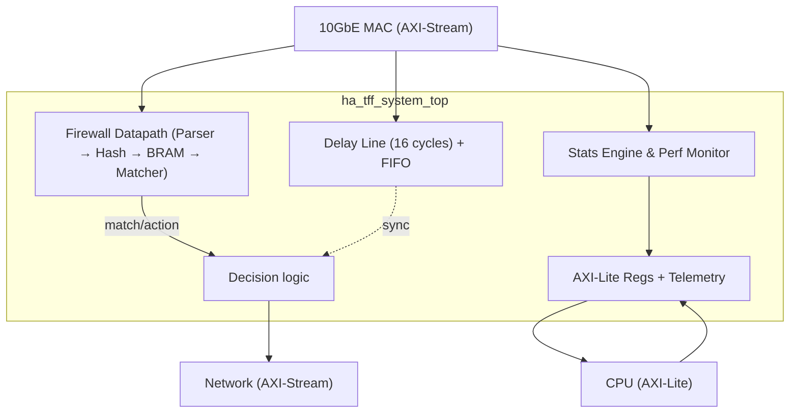

# HA-TFF: Hardware-Accelerated Telemetry Firewall

This is a pure-RTL, line-rate packet classification and telemetry firewall designed for FPGAs. It filters 10GbE (156.25 MHz, 64-bit AXI4-Stream) IPv4 TCP/UDP traffic using exact-match rules and tracks detailed telemetry data. You can control the rules and read the metrics from a CPU using an AXI4-Lite interface.

## How it works

When a packet arrives from the MAC:
1. We parse the Ethernet, IPv4, and TCP/UDP headers to grab the 5-tuple.
2. We hash this tuple using a keyed XOR-fold hash (to stop hash-flooding attacks).
3. We look up the hash in a 4-way Cuckoo-hash table (built from block RAMs).
4. If there's an exact match and the action says "forward", it goes through. Otherwise, it's dropped (default-deny).
5. While this decision is happening, the packet data waits in a 16-cycle delay line.
6. The statistics engine logs the packet count, bytes, protocol type, and any parsing errors.

If you just want to pass traffic without filtering, you can disable the firewall via the AXI-Lite control register.

## Architecture



The total pipeline latency is 16 clock cycles (around 102.4 ns at 156.25 MHz).

## Core Modules

- **Parser** (`ha_tff_parser_v002.v`): AXI-Stream FSM that extracts the 5-tuple.
- **Hash** (`ha_tff_hash_v002.v`): Keyed 4-seed hash. Fast, 1-cycle latency.
- **Rule Table** (`ha_tff_bram_bank.v`): 4 parallel banks of 4096x128-bit BRAM forming a Cuckoo hash table.
- **Matcher** (`ha_tff_matcher_v002.v`): 4-way parallel exact match.
- **Delay Line** (`axi_stream_delay_line.v`): Shift register that aligns the packet data with the decision logic.
- **Telemetry & Perf Monitor** (`ha_tff_statistics.v`, `ha_tff_performance_monitor.v`): Tracks RX/TX counts, stalls, occupancy, and latency.

## Repo Structure

```text
ha-tff-fpga/
├── rtl/            # Synthesizable Verilog
├── tb/             # Icarus testbenches
├── dv/             # SystemVerilog UVM-lite verification
├── sim/            # Simulation run scripts & memory files
├── constraints/    # Vivado TCL scripts
└── docs/           # Architecture records and bug reports
```

## AXI4-Lite Register Map

The AXI4-Lite slave provides runtime control and telemetry access. Here are the key byte offsets:

- `0x00 - 0x0C`: Hash secret keys (4 words)
- `0x10`: Control register (firewall enable, parser enable, stats reset)
- `0x20 - 0x48`: Standard telemetry (RX/TX packets, drops, bytes, protocol counts, parse errors)
- `0x50 - 0x60`: Rule programming interface (tuple data and bank control)
- `0x64 - 0x78`: Performance monitor (stalls, real-time occupancy, latency histogram)

*See the RTL comments in `ha_tff_axi_lite_regs.v` for bit-level details.*

## Quick Start

### Icarus Simulation
```bash
cd sim
iverilog -o sim.vvp -I ../rtl ../rtl/*.v ../tb/tb_ha_tff_system_top.v
vvp sim.vvp
```

### SystemVerilog DV
You'll need a real SystemVerilog simulator (Questa, Xcelium, etc.) for this, since it relies on SVA and constrained random generation.
```bash
vlog -sv -work work ../rtl/*.v ../dv/*.sv
vsim -c work.tb_ha_tff_dv_top -do "run -all"
```

### Synthesis (Vivado)
```bash
cd constraints
vivado -mode batch -source synth.tcl
```
*Targeting the Artix-7 `xc7a100tfgg484-1`.*

## Performance & Resources

Synthesized on Vivado 2026.1 (Artix-7 `xc7a100tfgg484-1`):

- **LUTs**: ~811 (1.28%)
- **Registers**: ~1608 (1.27%)
- **BRAM**: 48 blocks (35.56%)
- **DSPs**: 0 
- **Fmax**: Easily meets 156.25 MHz timing.

The design uses no DSP slices, keeping it highly portable and scalable. The I/O utilization is around 85% due to the wide AXI buses.

## Limitations
- **Protocols**: It only cares about IPv4 TCP/UDP. Things like ARP, IPv6, and ICMP will get dropped (and flagged as parse errors).
- **Default Deny**: If a packet doesn't match a rule, it gets dropped. You can bypass this by turning the firewall off via the control register.
- **Hardware only looks up rules**: The actual Cuckoo hashing math for *inserting* rules into the table has to be done in software before programming the hardware.

## License
MIT
